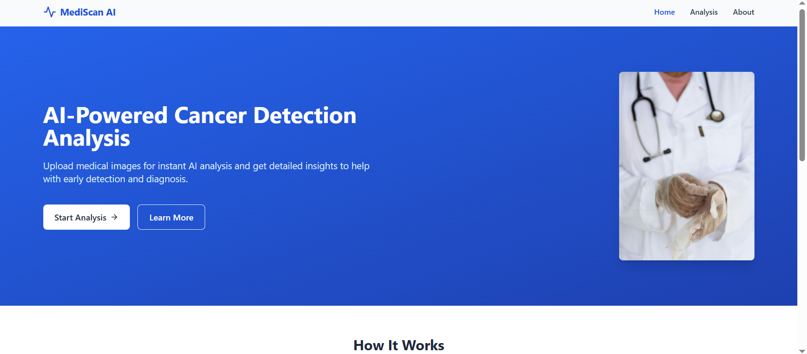
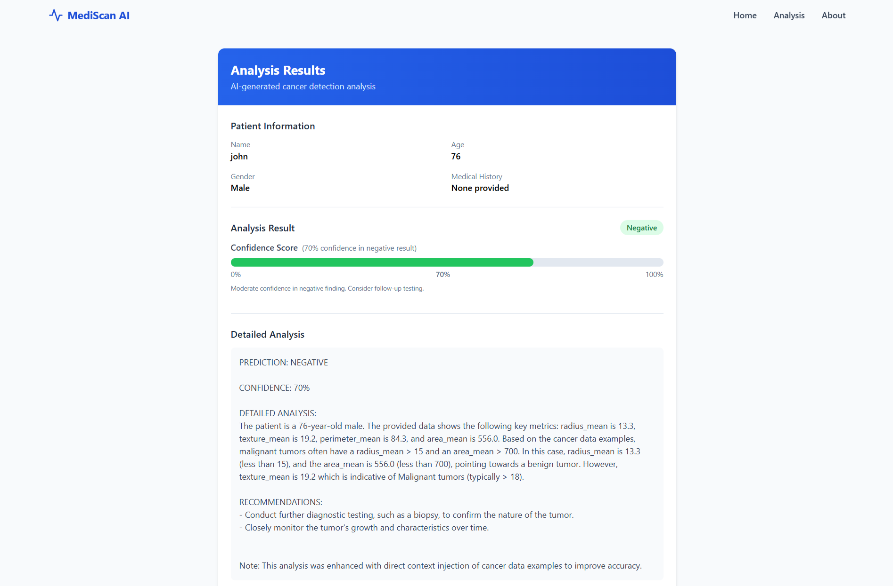
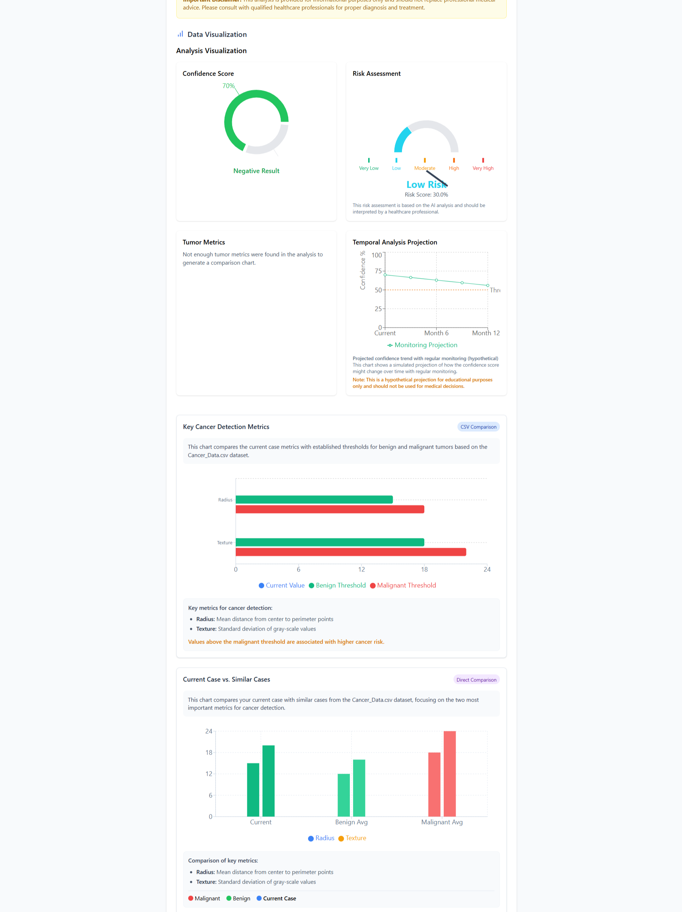

# MediScan AI: Cancer Detection Analysis

<div align="center">
  
  <br>
  <h3>Advanced Medical Image Analysis with AI</h3>
  <p>Leveraging Google's Gemini AI and Vector Database Technology for Enhanced Cancer Detection</p>

  
  
  
  
  
</div>

## 🔍 Overview

MediScan AI is an educational tool designed to demonstrate how artificial intelligence can assist in the analysis of medical images for potential cancer indicators. The application combines Google's powerful Gemini AI technology with reference MRI images from the "Breast Cancer Patients MRI's" dataset to provide contextually relevant analysis.

> **⚠️ Important Disclaimer**: MediScan AI is designed for educational purposes only and should not replace professional medical diagnosis. All results should be reviewed by qualified healthcare professionals.

## ✨ Key Features

### 🧠 AI-Powered Analysis
- Dual AI approach: Machine Learning model + Gemini AI for comprehensive analysis
- ML model trained directly on the MRI dataset for accurate classification
- Gemini AI provides detailed analysis and explanations
- Enhanced with reference MRI images from healthy and sick patients for more accurate results

### 📊 Advanced Visualizations
- **Key Metrics Comparison**: Compares detected metrics with benign and malignant thresholds
- **Case Comparison**: Directly compares current case with similar cases from the dataset
- **Risk Assessment Gauge**: Visual representation of overall risk level
- **Tumor Metrics Radar**: Compares multiple metrics against typical profiles
- **Temporal Analysis**: Projection of how metrics might change over time

### 📋 Comprehensive Reporting
- Generate detailed PDF reports with all visualizations
- Includes patient information, analysis results, and recommendations
- Professional layout suitable for educational purposes

### 🔄 MRI Reference Integration
- Uses reference MRI images from the "Breast Cancer Patients MRI's" dataset
- Enhances AI analysis with contextually relevant examples
- Provides reference points for comparison between healthy and sick patients

## 🖼️ Screenshots

<div align="center">
  
  &nbsp;&nbsp;
  
</div>

## 🚀 Getting Started

### Prerequisites
- Node.js (v18.18.0 or higher)
- npm (v9.0.0 or higher)
- Python (v3.8 or higher)
- pip (for Python package management)

### Installation

1. Clone the repository:
```bash
git clone https://github.com/mohamedsafi7/medi_scan.git
cd medi_scan
```

2. Install JavaScript dependencies:
```bash
npm install
```

3. Install Python dependencies:
```bash
pip install -r requirements.txt
```

4. Create a `.env` file in the root directory with your Gemini API key:
```
VITE_GEMINI_API_KEY=your_gemini_api_key_here
```

5. (Optional) Train the ML model on the MRI dataset:
```bash
python train_mri_model.py
```

6. Start the application (both frontend and Python backend):
```bash
start-app.bat
```

Alternatively, you can start the components separately:

- Start the Python backend:
```bash
set GEMINI_API_KEY=your_gemini_api_key_here
python mri_analysis_service.py
```

- Start the React frontend:
```bash
npm run dev
```

Note: If you skip the model training step, the application will still work using only the Gemini AI analysis.

## 📋 Usage Guide

### Analyzing Medical Images

1. Navigate to the Analysis page
2. Fill in the patient information form
3. Upload a medical image (supported formats: JPEG, PNG, WebP)
4. Click "Analyze" to process the image
5. View the detailed results with visualizations
6. Download the enhanced report with diagrams

### Recommended Image Types

- **MRI scans** (preferred for this analysis)
- Mammograms
- CT scans
- Histopathology images
- X-rays

The application is specifically optimized for breast MRI images from the "Breast Cancer Patients MRI's" dataset.

## 📊 Visualization Components

### Key Metrics Comparison
Compares the current case's key metrics with established thresholds for benign and malignant tumors based on reference MRI images.

### Case Comparison Chart
Directly compares the current case with similar cases from the MRI dataset, focusing on the key metrics for cancer detection.

### Risk Assessment Gauge
Provides an intuitive visualization of the overall risk level based on the AI analysis.

### Tumor Metrics Radar Chart
Shows how the current case's metrics compare to typical benign and malignant profiles across multiple dimensions.

### Temporal Analysis Projection
Displays a hypothetical projection of how the confidence score might change over time with treatment or monitoring.

## 🧩 Technical Architecture

### Frontend
- React with TypeScript
- Tailwind CSS for styling
- Recharts for data visualization
- React Router for navigation

### AI Integration
- Google's Gemini AI API for MRI image analysis
- Python backend for processing and analysis
- Prompt engineering for structured analysis results

### MRI Dataset Integration
- Reference MRI images from "Breast Cancer Patients MRI's" dataset
- Comparison between healthy and sick patient MRIs

### Data Processing
- MRI image processing and analysis
- Key metrics extraction for visualization

## 🔧 Development

### Project Structure
```
medi_scan/
├── src/                 # React frontend
│   ├── components/      # UI components
│   │   ├── analysis/    # Analysis-related components
│   │   ├── results/     # Visualization components
│   │   └── ui/          # Reusable UI components
│   ├── pages/           # Application pages
│   ├── services/        # API and data services
│   └── types/           # TypeScript type definitions
├── data/                # Reference MRI data
│   └── Breast Cancer Patients MRI's/
│       ├── train/       # Training MRI images
│       │   ├── Healthy/ # Healthy patient MRIs
│       │   └── Sick/    # Cancer patient MRIs
│       └── validation/  # Validation MRI images
│           ├── Healthy/ # Healthy patient MRIs
│           └── Sick/    # Cancer patient MRIs
├── mri_analysis_service.py  # Python backend for MRI analysis
├── requirements.txt     # Python dependencies
├── start-app.bat        # Script to start both frontend and backend
└── public/              # Static assets
```

### Key Files
- `mri_analysis_service.py`: Python backend for MRI image analysis with Gemini AI
- `src/services/geminiService.ts`: Frontend service to communicate with Python backend
- `src/components/results/*.tsx`: Visualization components
- `src/pages/Results.tsx`: Main results display page

## 📝 License

This project is licensed under the MIT License - see the LICENSE file for details.

## 🙏 Acknowledgements

- Google Gemini AI for providing the image analysis capabilities
- The creators of the "Breast Cancer Patients MRI's" dataset
- React, TypeScript, and Python communities for excellent development tools
- Medical professionals who provided guidance on cancer detection metrics

## 🤝 Contributing

Contributions are welcome! Please feel free to submit a Pull Request.

1. Fork the repository
2. Create your feature branch (`git checkout -b feature/amazing-feature`)
3. Commit your changes (`git commit -m 'Add some amazing feature'`)
4. Push to the branch (`git push origin feature/amazing-feature`)
5. Open a Pull Request

## 📬 Contact

Mohamed Safi - [@mohamedsafi7](https://github.com/mohamedsafi7)

Project Link: [https://github.com/mohamedsafi7/medi_scan](https://github.com/mohamedsafi7/medi_scan)
